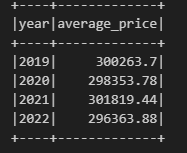
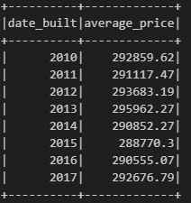
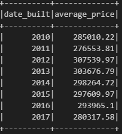
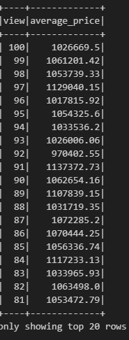

# Home Sales Data Analysis with PySpark

### Project on Big Data 

## Overview
This project uses PySpark and SparkSQL to analyze home sales data, answering key questions about real estate trends. The tasks include creating temporary views, partitioning data, caching, and uncaching tables to optimize query performance.

# Steps Taken

1. **Data Loading and Preparation**

- Imported the necessary PySpark SQL functions.
- Loaded the home_sales_revised.csv file into a Spark DataFrame.
- Created a temporary table named home_sales from the DataFrame.

2. **Data Analysis and Queries**

Below are the key metrics analyzed using SparkSQL: 

- **Average Price of Four-Bedroom Houses per Year:** Calculated the average price for four-bedroom houses sold each year, rounding the results to two decimal places.
- **Average Price of Three-Bedroom, Three-Bathroom Homes per Year:** Queried the average price of homes with three bedrooms and three bathrooms for each year the home was built, rounding to two decimal places.
- **Average Price of Homes with Specific Criteria:** Found the average price of homes with three bedrooms, three bathrooms, two floors, and at least 2,000 square feet, calculated for each year the home was built.
- **Average Price per "View" Rating:** Determined the average price of a home per "view" rating for homes with an average price greater than or equal to $350,000. The runtime for this query was also recorded.

(i) **Average price for a four-bedroom house sold for each year**

   

(ii) **Average price of a home for each year the home was built, with three bedrooms and three bathrooms**

   

(iii) **Average price of a home for each year the home was built, with three bedrooms, three bathrooms, two floors, and is greater than or equal to 2,000 square feet**

   

 (iv) **Average price of a home per "view" rating, with an average home price greater than or equal to $350,000**

   

3. **Optimization Techniques**

- **Caching:** Cached the home_sales temporary table and validated the cache.
- **Cached Query Execution:** Re-ran the query for average price per "view" rating on the cached table and compared the runtime to the uncached query.
- **Data Partitioning:** Partitioned the home sales dataset by the date_built field and saved the formatted data as Parquet files.
- **Parquet Data Queries:** Created a temporary table for the Parquet data and re-ran the query for average price per "view" rating, comparing the runtime to the cached and uncached versions.
- **Uncaching:** Uncached the home_sales temporary table and verified that it was uncached.

## Results
- **Performance Improvements:** Caching and partitioning significantly improved query performance, as evidenced by reduced runtimes when compared to the uncached versions.
- **Insights:** The analysis provided valuable insights into home sale trends, such as average prices based on bedroom count, bathroom count, square footage, and "view" ratings.

## Application:
The insights from this project can be applied in several ways:

- **Market Analysis:** Real estate professionals can use average price trends to understand market dynamics and set competitive pricing strategies.

- **Property Valuation:** Data-driven analysis helps appraisers and agents provide accurate property valuations based on specific features like size and view ratings.

- **Investment Decisions:** Investors can identify high-value properties and make informed investment choices by analyzing price trends and property attributes.

- **Optimized Data Processing:** The use of PySpark and SparkSQL demonstrates efficient handling of large datasets, enabling faster decision-making in real estate analytics.

- **Strategic Planning:** Developers can plan projects in high-demand areas and design homes with features that are proven to attract buyers.

Thank you.

Author

Stuti Poudel
